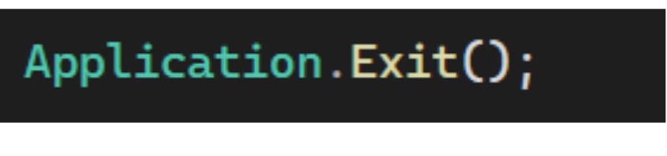

# MY assigments c# programing

Student Information System # ------Assigment two

Description This is a simple Student Information System developed using C#

Features #Creating variables These are screenshots:

 # Getting values from the user The application allows the user to enter student information such as:
Student Name Student ID Department Semester
 

 # Show the output After entering the information, the user can click the Show button to display the student details.

 
 # Clear all visible data Clear
 

 
  # Exit the file Exit
  

  # END

