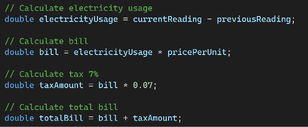

# screen shot 1
# Get values from TextBoxes
In this part, we get the values from the TextBoxes.
First, we get the customer name using textCustomer.Text.
Then, we get the previous meter reading, current meter reading, and price per unit.
Because TextBox values are stored as strings, we use double.Parse() to convert them into numbers.
This allows us to perform mathematical calculations.

# screen shot 2
# Calculate Bill, Tax & Total
In this part, we calculate the electricity usage.
We subtract the previous reading from the current reading.
For example, if the previous reading is 1000 and the current reading is 1250, the electricity usage is 250 units.

# screen shot 3
# Calculate Bill, Tax & Total
Here, we calculate the electricity bill, tax, and total bill.
First, we multiply electricity usage by the price per unit to get the bill.
Then, we calculate 7 percent tax by multiplying the bill by 0.07.
Finally, we add the bill and the tax to get the total bill.

# screen shot 4 
# Display Results
In this part, we display the calculated results to the user.
We display the electricity usage, tax amount, and total bill.
We use ToString() to convert the numbers into text so they can be displayed in the TextBox.
We also use ToString("0.00") to display two decimal places.

# screen shot 5
# Display Customer Information

In this part, we display all the customer information together.
We display the customer name, units used, bill, tax, and fixed charge.
The \n is used to create a new line, so each piece of information appears on a separate line.

# screen shot 6
# Error Message
This message appears when the user enters an invalid number.
For example, if the user enters letters instead of numbers, double.Parse() cannot convert the value into a number.
The catch block handles the error and displays the message: ‘Please enter valid numbers.

# End