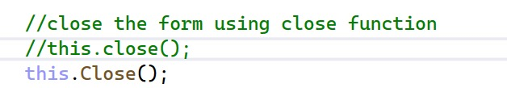

# Discouse chapter 1
# screenshot 1
This code creates variables to store the day of the week, month, day, and year. It gets the values from the user input using TextBoxes. Then, it uses string concatenation to combine these values into one full date. Finally, it displays the full date in a Label.

# screenshot 2

Clear TextBox and Label:

This code clears all the TextBoxes and the output Label. It removes the previous input and output, so the user can enter new data.

# screenshot 3
Close the Form:

This code closes the current form using the Close() function. It exits the form when the code is executed.

# end